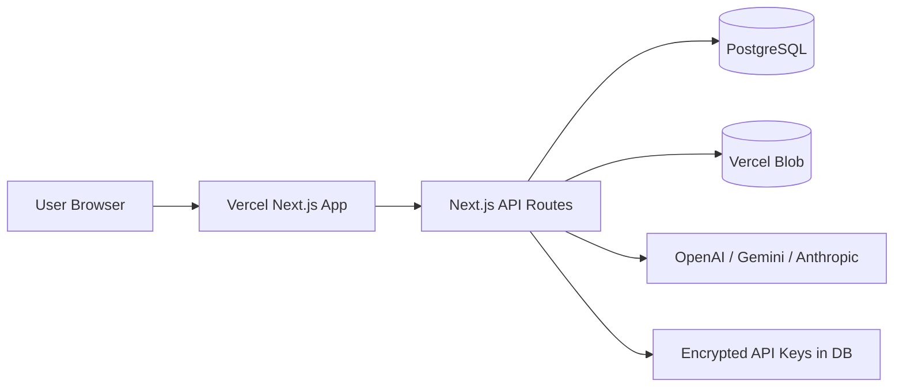
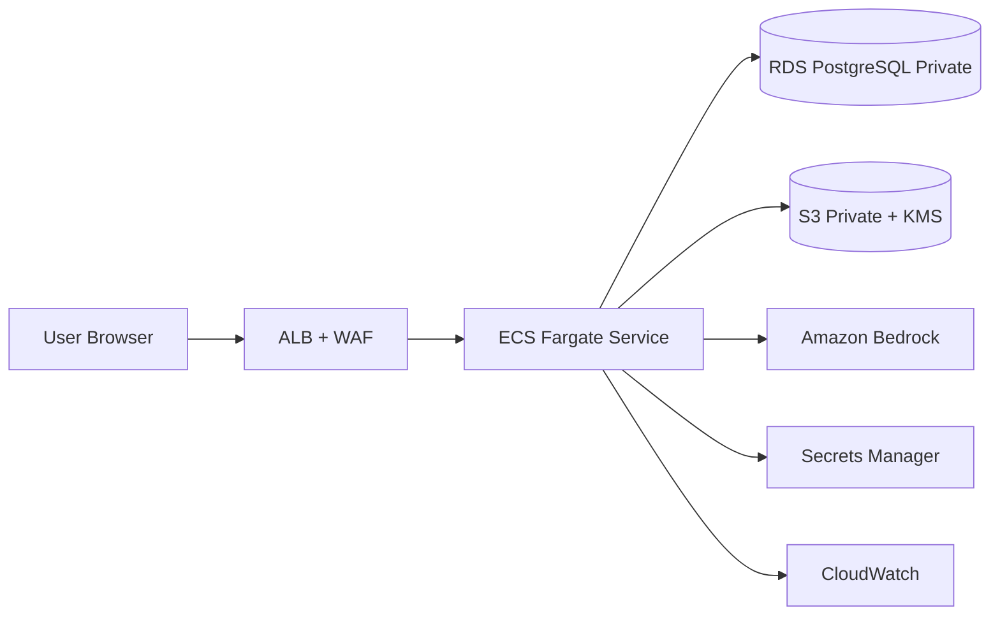

# Megafyle Technical Architecture: Current (Vercel) vs AWS Private Landing Zone

Last updated: 2026-03-08  
Product: **Megafyle** (by Megafy)

## 1) Current Architecture (Production on Vercel)

### 1.1 Current stack (from codebase)
- **Frontend + Backend**: Next.js 15 (App Router + API Routes), React 19.
- **Auth/session**: JWT cookie (`httpOnly`, `sameSite=lax`, secure in prod).
- **Database**: PostgreSQL via Prisma (currently external managed DB; in your deployment this has been Neon).
- **Document storage**: Vercel Blob.
- **AI layer**:
  - Multi-provider runtime: OpenAI, Gemini, Anthropic.
  - Configurable per company for extraction/search provider + model.
  - Signature detection (AI + heuristic fallback).
  - PII detection + masking toggle in UI.
- **Security controls recently added**:
  - API keys per provider and per company.
  - Encryption at rest for provider keys (AES-256-GCM).
  - `AUTH_SECRET` required in production.
  - Search cache isolated by user.

### 1.2 Logical architecture (current)

### 1.3 Strengths (current state)
- Fast iteration and deployment.
- Low ops overhead.
- Good UX iteration speed for product discovery.
- Multi-provider AI configurable from admin.

### 1.4 Current limitations
- Network/security boundary split across providers (Vercel + external DB + external LLM APIs).
- Harder to enforce full private networking/east-west controls.
- Compliance posture depends on multiple third-party platforms and public API paths.

---

## 2) Target Architecture (All-in AWS, private)

### 2.1 Recommended target design
- **Compute**: ECS Fargate (private subnets) for Next.js app/API.
- **Ingress**: ALB + AWS WAF.
- **Database**: Amazon RDS PostgreSQL (private subnets, Multi-AZ optional).
- **Object storage**: Amazon S3 private buckets (+ KMS).
- **AI**: Amazon Bedrock (Claude/Titan/etc.) via IAM.
- **Secrets**: AWS Secrets Manager + KMS.
- **Identity**: Cognito or enterprise SSO (OIDC/SAML).
- **Observability**: CloudWatch Logs/Metrics + alarms (and X-Ray optional).

### 2.2 Logical architecture (AWS private)

---

## 3) Vercel vs AWS (technical comparison)

| Dimension | Current Vercel | Full AWS Private |
|---|---|---|
| Time to ship | Very fast | Medium (infra setup first) |
| Ops complexity | Low | Medium/High |
| Network isolation | Limited (public SaaS boundaries) | Strong (private subnets, VPC controls) |
| Compliance posture | Good for many SMB/mid cases | Better for regulated/enterprise controls |
| AI governance | Multi-provider via external APIs | Centralized via Bedrock/IAM |
| Cost predictability | Good at low/medium scale | Better at steady medium/high scale if well-architected |
| Vendor lock-in | Lower infra lock-in | Higher AWS lock-in |

---

## 4) Why move to AWS private (benefits)

1. **Security boundary consolidation**: app, DB, storage, AI under one cloud governance model.
2. **Private networking**: tighter egress control and reduced public exposure.
3. **Enterprise controls**: IAM, KMS, CloudTrail, WAF, SCP, tagging/policies.
4. **AI governance**: Bedrock model access through IAM, centralized quota/cost governance.
5. **Compliance readiness**: easier path for regulated industries (financial/insurance/document-heavy operations).
6. **Data residency/options**: stronger region and account-level controls.

---

## 5) Cost estimate (high-level)

> Estimates are directional (not a quote). Region assumed: **us-east-1**.  
> AI cost is workload-dependent and is usually the largest variable.

### 5.1 Current Vercel baseline (indicative)
- **Vercel Pro platform**: **$20/month** (1 seat included).
- **Vercel Blob (usage-based)**: storage/ops/transfer variable.
- **External DB (Neon or equivalent)**: variable by plan/compute/storage.
- **AI providers**: variable by token/image/file usage.

Practical total (without heavy AI): typically **$40–$250+/month** depending on DB + Blob + seats.

### 5.2 AWS private baseline (indicative)
Typical monthly components:
- **ECS Fargate app** (example 1 vCPU + 2GB, always on):
  - vCPU: `0.000011244 USD/sec` (from AWS Fargate pricing example)
  - Memory: `0.000001235 USD/GB-sec` (from AWS Fargate pricing example)
  - Approx monthly compute: **~$36**
- **ALB**:
  - Base: `~$0.0225/hour`
  - + LCUs (usage-dependent, e.g. 1 LCU avg adds `~$0.008/hour`)
  - Approx: **$16–$40+**
- **RDS PostgreSQL**:
  - Strongly workload/config dependent (Single-AZ vs Multi-AZ, class, IOPS).
  - Typical SMB/mid footprint often lands **~$60–$250+**.
- **S3 documents**:
  - Usually low-to-medium unless large retention/high egress.
- **NAT Gateway (if used)**:
  - `~$0.045/hour` + `~$0.045/GB` processed.
  - Can become material if traffic is high.
- **Bedrock AI**:
  - Example (Claude 3.5 Sonnet in Bedrock):
    - Input: `$6 / 1M tokens`
    - Output: `$30 / 1M tokens`

### 5.3 Example Bedrock AI cost formula
`Monthly AI cost = (InputTokens/1M * InputPrice) + (OutputTokens/1M * OutputPrice)`

Example:
- 20M input tokens + 5M output tokens using Claude 3.5 Sonnet
- Cost = `20*6 + 5*30 = 120 + 150 = $270/month`

### 5.4 Total AWS private (reference ranges)
- **Low** usage: **$180–$450/month**
- **Medium** usage: **$450–$1,500/month**
- **High** usage (AI/document-heavy): **$1,500+ /month**

These ranges depend mostly on:
- Bedrock token volume
- RDS sizing/HA mode
- NAT/data transfer pattern

---

## 6) Migration recommendation

### Suggested path
1. **Phase 1 (2–3 weeks)**: Move app + DB + storage to AWS, keep current behavior.
2. **Phase 2 (1–2 weeks)**: Switch AI runtime to Bedrock adapter.
3. **Phase 3 (1–2 weeks)**: Hardening (WAF, private endpoints, secrets rotation, backup/DR runbooks).

### Decision guidance
- If priority is **speed/cost for product iteration**: stay on Vercel now.
- If priority is **enterprise security/compliance/private perimeter**: move to AWS private.

---

## 7) Pricing references used

- Vercel Pro Plan: https://vercel.com/docs/plans/pro
- Vercel Pricing: https://vercel.com/pricing
- Vercel Blob usage/pricing: https://vercel.com/docs/vercel-blob/usage-and-pricing
- AWS Fargate pricing: https://aws.amazon.com/fargate/pricing/
- AWS ELB pricing: https://aws.amazon.com/elasticloadbalancing/pricing/
- AWS RDS PostgreSQL pricing: https://aws.amazon.com/rds/postgresql/pricing/
- Amazon S3 pricing: https://aws.amazon.com/s3/pricing/
- Amazon Bedrock pricing: https://aws.amazon.com/bedrock/pricing/
- NAT Gateway pricing: https://aws.amazon.com/vpc/pricing/
